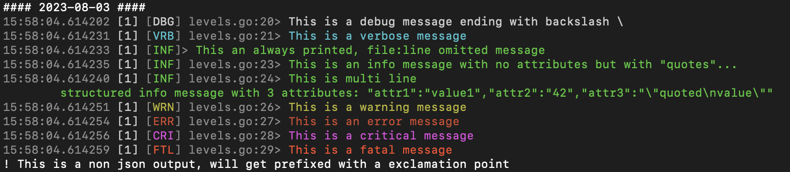

# logc
Converts [fortio.org/log](https://github.com/fortio/log#log) JSON structured log back to console/text output with colors

Note that since log 1.6 output is colorized already by default on terminals. But this is to interpret/colorize server logs. The output is very similar except for attributes where this is simpler/faster output reversing the attributes string "as is".

## Example
```
go run ./levelsDemo 2>&1 | logc
```



If you don't want colors; pass `-no-color`

## Installation

If you have a recent go installation already:
```shell
CGO_ENABLED=0 go install fortio.org/logc@latest
```

Or get one of the [binary releases](https://github.com/fortio/logc/releases)

Or using the docker image
```shell
docker run fortio/logc
```

Or using brew (mac)
```shell
brew install fortio/tap/logc
```

# Development

Run make for both go tests and human check colorization example
```
make
```

Update the screenshot:

```
make screenshot
```
